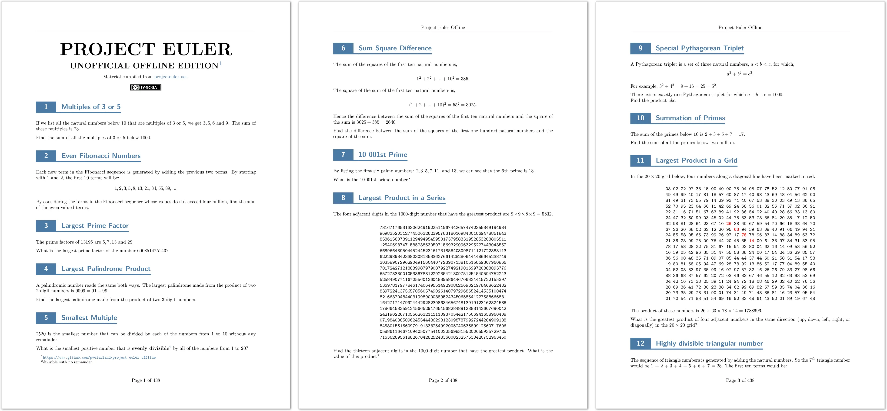
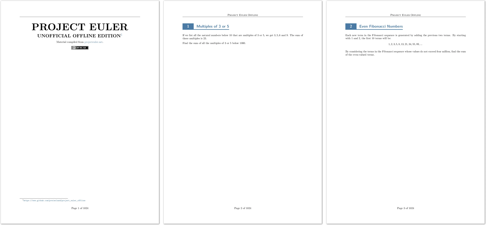

# Project Euler Offline

Project Euler Offline is an unofficial compilation of the [Project Euler](https://projecteuler.net/) problem set for offline use.

- It contains all Project Euler problems as of the date of compilation, including all problem data files as PDF attachments via the [attachfile2 LaTeX plugin](https://ctan.org/pkg/attachfile2).
- Animations are produced with the [animate LaTeX plugin](https://ctan.org/pkg/animate). Note that animations require a PDF reader with JavaScript support. Support has been confirmed in [Okular](https://okular.kde.org/) on Linux (remember to select *View* → *Show Forms*).
- Bonus feature: Appendix about Roman numerals.

## Download

Project Euler Offline is available in a compact and a spaced version. The spaced version renders problems on individual pages to leave room for note taking.

### Compact

[](https://github.com/pveierland/project_euler_offline/releases/latest/download/project_euler_offline.pdf)

[](https://github.com/pveierland/project_euler_offline/releases/latest/download/project_euler_offline.pdf)

### Spaced

[](https://github.com/pveierland/project_euler_offline/releases/latest/download/project_euler_offline_spaced.pdf)

[](https://github.com/pveierland/project_euler_offline/releases/latest/download/project_euler_offline_spaced.pdf)

## Usage

Download problem data:

```
python -m project_euler_offline fetch
```

Render compact version to PDF:

```
python -m project_euler_offline render --pdf
```

Render spaced version to PDF:
```
python -m project_euler_offline render --pdf --spaced
```

NB: Note that files are also downloaded during rendering.

## License

- The original content of this repository is licensed under the [Creative Commons Attribution-NonCommercial-ShareAlike 4.0 International (CC BY-NC-SA 4.0) license](https://creativecommons.org/licenses/by-nc-sa/4.0/).
- Content within the `source_mods` folder are direct copies from Project Euler with necessary modifications for the compilation.
